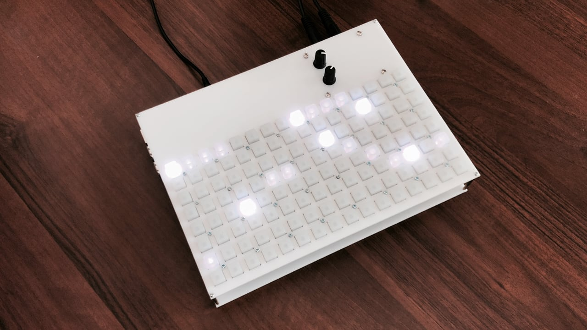

# nótt

Standalone [mlr](https://monome.org/docs/norns/dust/tehn/mlr/) & [norns](https://monome.org/norns/) inspired sampler, looper and granular instrument.

<p align="center"></p>

**Warning**: instruction below is for a build from commit `da26d36081023a1721897fcc5c4f9a3c9ec9ea12` when NeoTrellis grid was soldered to Pisound. Since then I moved to having Pisound in the original case, and talking with monome through USB serial. If you want to follow this instruction, revert to the linked commit. If you want to use monome through USB serial, then ignore the soldering and GPIO parts.

## Usage

[Click here for detailed info.](./docs/USAGE.md)

## Hardware

- 1x Raspberry Pi 3B+
- 8x [Adafruit NeoTrellis](https://www.adafruit.com/product/3954)
- 8x [Elastomer for NeoTrellis](https://www.adafruit.com/product/1611)
- 1x [Blokas Pisound](https://blokas.io/pisound)

1. solder NeoTrellis into 2x4 grid
   - remember about [addressing](https://learn.adafruit.com/adafruit-neotrellis/tiling#addressing-2-11)
   - you can edit (and see my) address in [`./ui/ui.py`](./ui/ui.py) file
2. solder NeoTrellis to [Pisound GPIO](https://blokas.io/pisound/docs/Specs/#raspberry-pi-pins-used-by-pisound):

   | NeoTrellis | Pisound      |
   | ---------- | ------------ |
   | `GND`      | `GND`: `1`   |
   | `VIN`      | `3.3V`: `4`  |
   | `SDA`      | `BCM2`: `13` |
   | `SCL`      | `BCM3`: `14` |
   | `INT`      | `BCM5`: `5`  |

3. optionally, desolder MIDI ports and Raspberry Pi connection, and wire by hand for smaller form size

## Installation

1. setup Raspbian Lite on SD Card
2. ssh into Raspberry Pi
3. setup Pisound: `curl https://blokas.io/pisound/install-pisound.sh | sh`
4. enable `i2c` in `raspi-config`
5. install python deps:

```bash
sudo apt-get install -y python3-pip
sudo pip3 install --upgrade setuptools

sudo apt-get install -y python-smbus
sudo apt-get install -y i2c-tools
sudo apt-get install -y python3-liblo

pip3 install RPI.GPIO
pip3 install adafruit-blinka
pip3 install adafruit-circuitpython-neotrellis
```

6. install chuck from source (**notice the _patch_**):

```bash
mkdir ~/temp && cd ~/temp

git clone https://github.com/ccrma/chuck.git chuck-git

sudo apt-get install bison flex libasound2-dev libsndfile1-dev

cd chuck-git/src/
make linux-alsa

mkdir ~/.bin
cp chuck ~/.bin/chuck
```

7. `git clone git@github.com:szymonkaliski/nott.git ~/app && cd ~/app`
8. `./scripts/systemd-setup.sh`
9. `./scripts/systemd-start.sh`
10. optionally, disable `pisound-ctl`: `./scripts/systemd-disable-pisound-ctl.sh`

## Case

The STL & SVG files are available in [`./case/dist`](./case/dist) folder. I laser-cut mine in plexi.

If you want to work on the case:

1. `cd ./case`
2. `npm i`
3. open `model.js`
4. open `http://localhost:3000`

Case was designed in [modeler](https://github.com/szymonkaliski/modeler).
