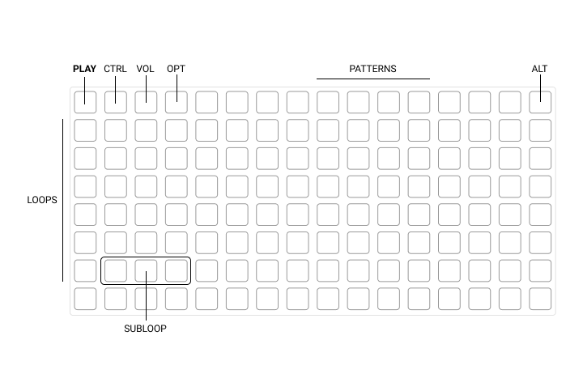
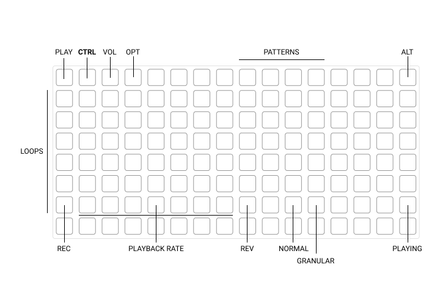
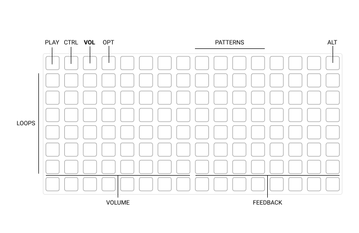
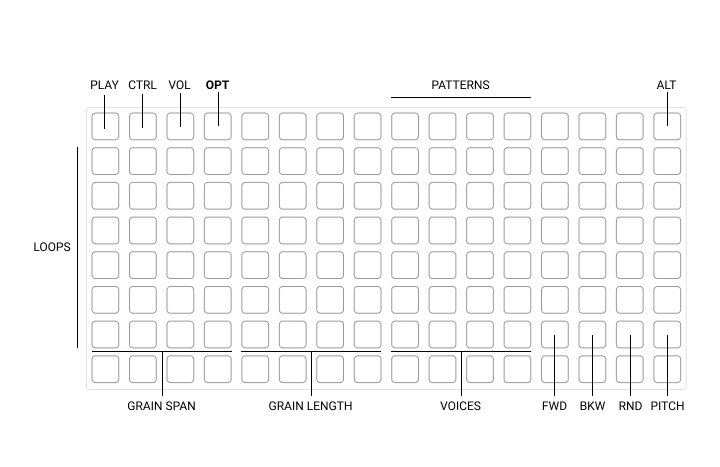

# nótt usage instruction

There's four main cards controled by upper left buttons:
- `play` - main screen for looping/jumping
- `ctrl` - main control screen
- `vol` - volume and feedback control
- `opt` - random buttons, mainly granular-mode related

## play

- `play` mode displays loop position
- touching any of the loop control points jumps to that position
- holding one of the jump positions, and then touching another one creates subloop

## ctrl

- `rec` turns recording on/off (multiple loops can record at the same time)
- playback rate controls speed of replay
- `rev` turns playing backwards on/off
- `normal` switches to normal (defaul) mode
- `granular` switches to granular playback mode
- playing toggles playback on/off
- to clear buffer, hold `alt` and touch `rec`

## vol

- `volume` controls loop volume
- `feedback` controls recording feedback (only influences the loop when `rec` is on)

## opt

- these options only influence the loop in granular mode
- `span` controls the granules span around current playback position
- `length` controls length of the granules
- `voices` controls amount of granules
- `fwd` switches granules to play forward (default)
- `bkw` switches granules to play backward
- `rnd` switches granules to play in random direction
- `pitch` toggles on/off if sample playback speed influences granule playback speed (default to off)

## patterns

- touch one of the four pattern buttons to start recording
  - every action is recorded - not only playback position, but also volume, rate, etc.
- touch the pattern button to stop recording
- touch it again to start looping the recorded actions
- hold `alt` and touch the pattern to delete it

